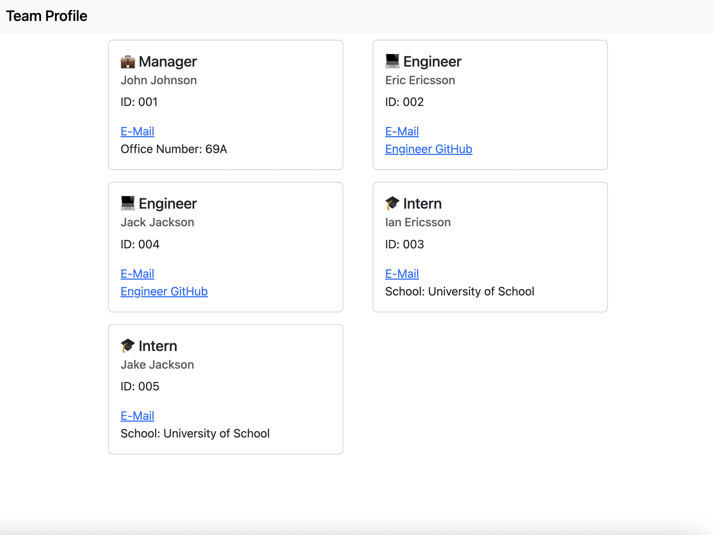

# Team Profile Generator CLI

## Description
This CLI uses inquirer to take in information about a team and generate HTML to quickly display team information in an orderly fashion. On click, employee email adresses take the user to their default email application and GitHub links for engineers open in a new tab.

## Screenshot

## Links
[Github Repo](https://github.com/kevinkraiss/team-profile-generator-cli)

[Video Example](https://drive.google.com/file/d/1_VWf22VGu9F_Zjm_iHpCEcXjNfcTTWHb/view)